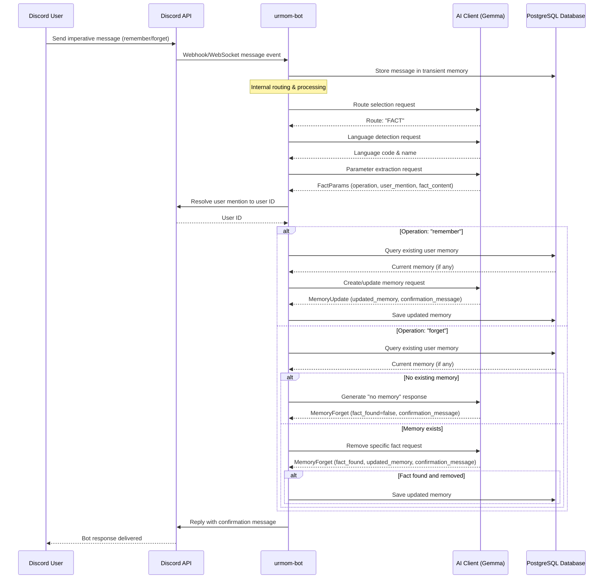

# Fact Request Processing Flow

This diagram shows the external interactions during FACT request processing in the urmom-bot Discord bot.

## External Integrations

### Discord API
- **Inbound**: Webhook/WebSocket events for imperative memory commands
- **Outbound**: Resolve user mentions to user IDs, send confirmation replies

### AI Client (Gemma)
- **Route Selection**: Identify imperative memory commands (remember/forget)
- **Language Detection**: Identify message language for response localization
- **Parameter Extraction**: Extract operation type, user mention, and fact content
- **Memory Operations**: 
  - Create/update user memory with new facts
  - Remove specific facts from existing memory
  - Generate language-appropriate confirmation messages

### PostgreSQL Database
- **Memory Storage**: Store and retrieve user facts/memories
- **Memory Updates**: Save updated memory blobs after AI processing
- **Message Storage**: Store messages in transient memory for context

## Memory Operations

### Remember Operation
1. **Query existing memory** for the target user
2. **AI processing** to merge new fact with existing memory
3. **Database update** with merged memory blob
4. **Confirmation** with specific fact content

### Forget Operation
1. **Query existing memory** for the target user
2. **AI analysis** to locate and remove specific fact
3. **Database update** only if fact was found and removed
4. **Confirmation** indicating success or fact not found

## Key Features

- **Imperative Commands Only**: Only processes direct commands like "remember" or "forget"
- **User Resolution**: Handles Discord mentions, user IDs, and nicknames
- **Third-Person Perspective**: Converts facts to third-person for consistent memory storage
- **Multilingual Support**: Processes commands and generates responses in the detected language
- **Intelligent Merging**: AI handles conflicts and maintains narrative flow when updating memories