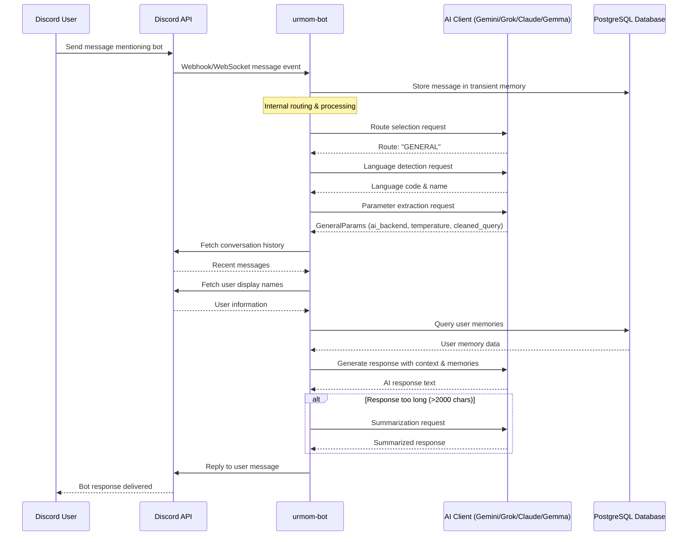

# General Request Processing Flow

This diagram shows the external interactions during GENERAL request processing in the urmom-bot Discord bot.

## External Integrations

### Discord API
- **Inbound**: Webhook/WebSocket events for new messages
- **Outbound**: Fetch conversation history, user information, send replies

### AI Clients (Gemini/Grok/Claude/Gemma)
- **Route Selection**: Determine if request is GENERAL, FAMOUS, FACT, or NONE
- **Language Detection**: Identify message language for response localization
- **Parameter Extraction**: Extract ai_backend, temperature, and cleaned_query
- **Response Generation**: Generate final response with conversation context and memories
- **Summarization**: Compress responses exceeding Discord's 2000 character limit

### PostgreSQL Database
- **Message Storage**: Store messages in transient memory for context
- **User Memories**: Query stored facts about users for personalized responses

## AI Client Selection Logic

The extracted `ai_backend` parameter determines which AI service processes the request:
- **gemini_flash**: General questions, explanations, current events
- **grok**: Creative tasks, uncensored content  
- **claude**: Coding help, technical analysis, fact-checking
- **gemma**: Fallback option, explicit requests only